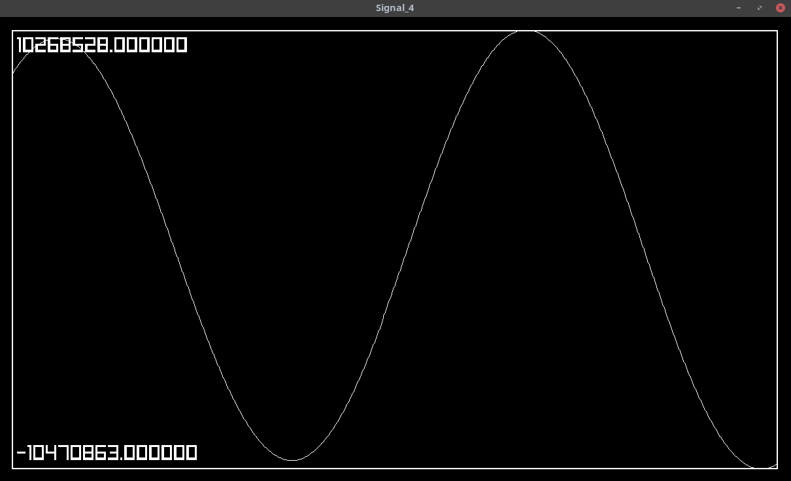
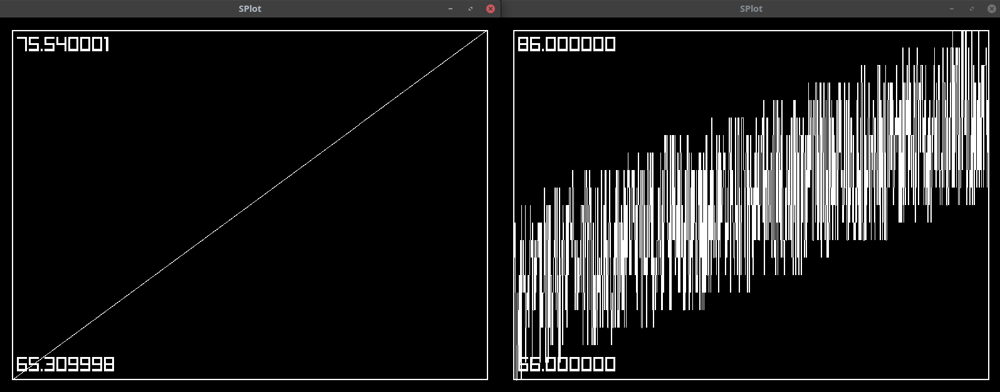
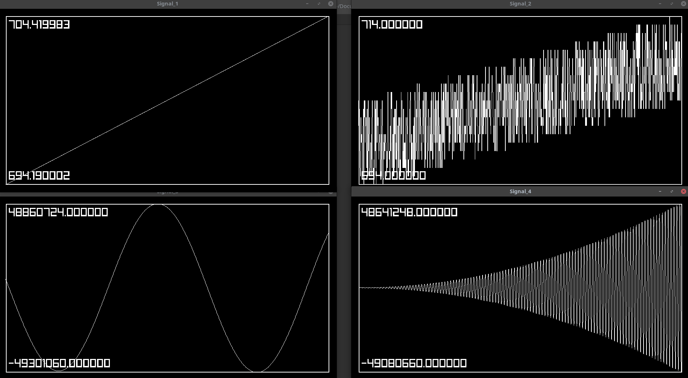

# splot
splot takes in a signal from stdin and plots the signal in a GUI window



## Dependencies

- Make	: for building
- Raylib: for drawing the GUI

## building

simply run `make` in the directory root

## usage

pipe any desired source into splot as follows.
```source_program | ./splot```
or for reading files:
```./splot < file```

splot wil plot the first valid float value in every line coming into stdin.

you can test this using the test.py script.
```python test.py | ./splot```

### options

| option(s) | desccription | default |
|-|-|-|
| -n | set window name to identify a signal | "SPlot" |
| -x/y | set initial position of window | 0/0 |
| -w/h | set width and height of window | 800/600 |

### plotting multiple signals

for plotting multiple signals `ssplit` can be used.
`ssplit` splits up a stdin stream based on a seperator and sends the output to up to 32 child processes.
e.g.
```python test.py | ./ssplit "./splot" "./splot -x 800"```
this will create two splot windows with different signals.



Also have a look at the `quad.sh` script which shows how to use splot with options to create a basic layout.
```python test.py | ./quad.sh```




